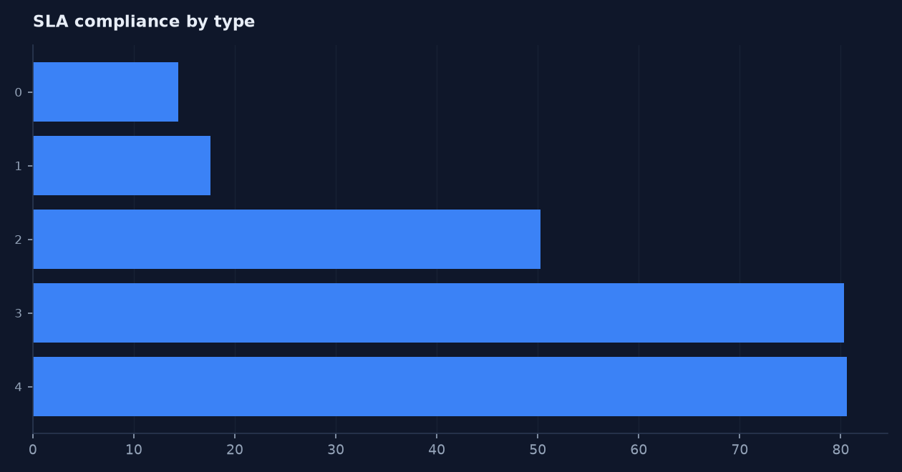
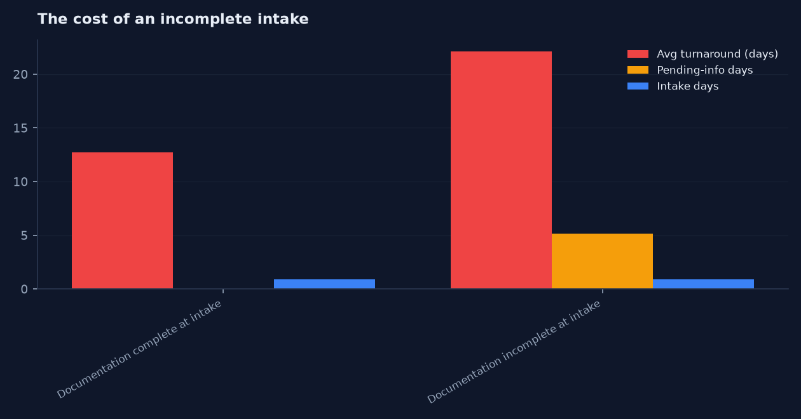
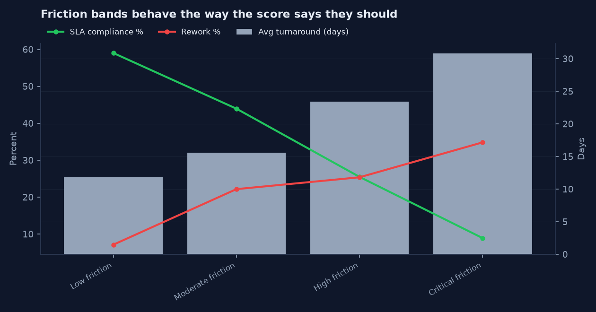

# Appeals Friction Radar

Where does an appeal actually lose time?

**Live dashboard: [https://careersahrafanousi-debug.github.io/appeals-friction-radar/dashboard/](https://careersahrafanousi-debug.github.io/appeals-friction-radar/dashboard/)**

Built by [`src/build_dashboard.py`](src/build_dashboard.py) from the query set in
[`dashboard/dashboard_config.json`](dashboard/dashboard_config.json), run against `data/appeals.db`.
Every number on the page comes out of a SQL query held in that config file, so the page
cannot drift away from the analysis in [`sql/`](sql/) — regenerate it with
`python src/load_sqlite.py && python src/build_dashboard.py`. Chosen over a `.pbix`
because a reviewer can open a URL and cannot open a binary.

## Built in four tools, from one set of queries

The 14 SQL queries in [`dashboard/dashboard_config.json`](dashboard/dashboard_config.json)
are the single definition of every number in this repository.
[`src/build_bi_assets.py`](src/build_bi_assets.py) runs them once and emits every
artifact below, so none of them can disagree with each other or with
[`sql/`](sql/). Change a query, rerun, and all four change together.

| Folder | What is in it | Open it with |
|---|---|---|
| [`dashboard/`](dashboard/) | Interactive HTML dashboard, [live here](https://careersahrafanousi-debug.github.io/appeals-friction-radar/dashboard/) | Any browser, nothing to install |
| [`excel/`](excel/) | `appeals-friction-radar_dashboard.xlsx` — native Excel charts over `q_*` query sheets | Excel, LibreOffice, Sheets |
| [`tableau/`](tableau/) | `appeals-friction-radar.twb` — Tableau workbook as reviewable XML | Tableau Desktop or Public |
| [`powerbi/`](powerbi/) | Semantic model in TMDL (17 files) and TMSL, plus 28 DAX measures | Power BI Desktop, Tabular Editor |
| [`charts/`](charts/) | Static PNG renders of the headline findings | Nothing — they are below |
| [`bi_extracts/`](bi_extracts/) | 14 tidy CSV outputs, the shared source for Tableau and Power BI | Anything |

Rebuild everything:

```
python src/generate_data.py
python src/load_sqlite.py
python src/build_dashboard.py
python src/build_bi_assets.py
```

No `.pbix`, `.twbx`, or other binary workbook is committed anywhere. They cannot
be diffed, reviewed in a pull request, or opened without a licence, and they
carry a second copy of the data that drifts away from `data/`. The text formats
above give the same result and stay reviewable. Each folder's `README.md`
explains its own trade-offs, including what has and has not been round-tripped
through the vendor tool.

### Headline charts








Most appeals reporting stops at turnaround time. That tells you the queue is slow, not
why. This project rebuilds the appeals workflow as event-level data so delay can be
traced to a specific step — intake validation, routing, waiting on records, handoffs,
escalation, or closure — and then scores each case on how much friction it has picked up.

Fictional organization: **Pathway Appeals Services**. All data in this repo is synthetic
and generated by the scripts in `src/`.

---

## The business problem

Pathway Appeals Services handles roughly 10,000 appeals a quarter across seven payers and
eight review teams. Leadership can see that SLAs are being missed but cannot tell whether
the problem is intake quality, routing decisions, reviewer capacity, or waiting on
outside documentation. Every proposed fix is a guess, and the teams disagree about where
the bottleneck sits.

## Stakeholders

| Stakeholder | What they need from this |
|---|---|
| Appeals operations manager | Daily view of which open cases are about to miss SLA |
| Intake supervisor | Evidence of which intake gaps cause downstream rework |
| Clinical review lead | Workload and dwell time for their queues |
| Quality / compliance lead | Documentation completeness and exception tracking |
| Reporting analyst | Defined KPIs and a data-quality log they can defend |
| Leadership | One number per month they trust, with drill-down |

## Scope and assumptions

In scope: first-level appeals received 2026-01-01 through 2026-09-30, intake through
closure, administrative and clinical review paths.

Out of scope: external review / independent review organizations, grievances,
member-facing correspondence content, cost or payment amounts.

Assumptions:
- SLA targets are fixed by appeal type and priority (7, 14, or 30 calendar days).
- Business days exclude weekends; holidays are not modeled.
- An appeal not closed by 2026-09-30 is treated as open, not as an SLA miss.
- The Friction Score weights are a prototype, not a validated model.

## Data source statement

Fully synthetic. Generated by `src/generate_data.py` with a fixed random seed. No
employer data, no patient data, no protected health information, no real payer or
organization names, no confidential metrics. See `docs/PRIVACY.md`.

---

## Data model

Star schema, one fact table plus an event log.

```
            dim_payer        dim_team        dim_reason_code     dim_date
                 |                |                  |              |
                 +--------+-------+---------+--------+-------+------+
                          |                 |                |
                    appeals_fact  1 ----- many  appeal_events
```

| Table | Grain | Rows |
|---|---|---|
| `appeals_fact` | one row per appeal | 3,966 (after cleaning) |
| `appeal_events` | one row per workflow event | 35,443 (~8.9 per appeal) |
| `dim_payer` | payer | 7 |
| `dim_team` | review team | 8 |
| `dim_reason_code` | delay / reason code | 15 |
| `dim_date` | calendar day | 333 |

The event log is the part that matters. Because every state change carries a timestamp,
stage, team, and delay reason, you can measure dwell time per stage with a `LEAD()`
window function instead of guessing from a handful of milestone columns.

Full field-by-field definitions: [`docs/03_data_dictionary.md`](docs/03_data_dictionary.md).

## Data quality approach

The generator deliberately injects dirty records — duplicate appeal IDs, `Y`/`N` instead
of `Yes`/`No`, lowercase status values, closed cases with no outcome, reversed date pairs,
an untrimmed lowercase payer code. `src/clean_validate.py` runs 12 rules against the
extract, standardizes what it can, logs every failure to `dq_exceptions.csv`, and blocks
records with Critical failures from the reporting layer rather than quietly fixing them.

Last run: 4,018 rows in, 66 exceptions logged, 34 records blocked,
**Data Quality Score 98.71%** (records passing all required rules ÷ total records).

## KPI definitions

| KPI | Definition |
|---|---|
| Appeal volume | Count of appeals by `Received_Date` |
| Open backlog | Appeals with `Status <> 'Closed'` as of the reporting date |
| Median turnaround | Median of `Closed_Date - Received_Date` for closed appeals |
| SLA compliance | Closed appeals where turnaround ≤ `SLA_Target_Days` ÷ closed appeals |
| First-pass routing accuracy | Appeals never rerouted ÷ all appeals |
| Rework rate | Appeals with `Rework_Flag = 'Yes'` ÷ all appeals |
| Documentation completeness | Appeals with complete intake documentation ÷ all appeals |
| Friction Score | See below |

### Friction Score

```
Friction Score = 25 x (documentation incomplete)
               + 20 x (initial routing incorrect)
               + 10 x (each reassignment, capped at 4)
               + 15 x (escalated)
               + 20 x (pending information > 5 days)
               + 10 x (closure delay > 2 days)
```

| Score | Category | Meaning |
|---|---|---|
| 0–19 | Low friction | Clean processing path |
| 20–39 | Moderate friction | Some rework or delay risk |
| 40–59 | High friction | Multiple workflow issues |
| 60+ | Critical friction | High probability of SLA failure |

This is a triage heuristic, not a trained model. The weights came from the process map,
not from fitting. Before any real use it would need calibration against actual outcomes
and sign-off from the intake and clinical review leads.

## Analysis approach

`sql/06_sql_analysis.sql` holds 14 queries covering volume, turnaround by payer,
SLA compliance by team and priority, first-pass routing accuracy, stage dwell time from
the event log, handoff impact, documentation impact, the pending-information queue,
top delay reasons, score validation, backlog aging, and misrouting pairs.

Written for SQLite so the repo runs with no database install. Median turnaround uses a
`ROW_NUMBER()` workaround because SQLite has no `PERCENTILE_CONT`; the Postgres
equivalent is noted in the file.

## Findings

Numbers below are from the synthetic dataset in this repo and describe the modeled
scenario only.

1. **Documentation completeness is the dominant driver.** Appeals with incomplete intake
   documentation had a 31.7% rework rate versus 7.7% when documentation was complete, and
   an average Friction Score of 47.5 versus 7.2.

2. **Handoffs compound delay.** Average turnaround was 13.4 days with no reassignment,
   18.3 days with one, 25.6 days with two, and 28.4 days with three. SLA miss rate climbed
   from 46% to 83% across the same range.

3. **Review is the longest stage, but the wait in front of it is avoidable.** Average
   closed-case time splits as intake 0.9 days, routing 1.9, waiting for review to start
   1.6, review 9.1, closure 1.5. Roughly 4.3 days per appeal sit outside actual review
   work.

4. **The score separates outcomes.** SLA miss rate rose monotonically across friction
   categories: 41% Low, 56% Moderate, 75% High, 91% Critical. Average turnaround went
   11.8 → 15.6 → 23.4 → 30.8 days.

5. **Claims payment appeals are routed worst.** First-pass routing accuracy was 81.7% for
   claims payment versus 87–89% for every other type, pointing at a classification rule
   gap at intake rather than a reviewer problem.

Caveat worth naming: even Low-friction appeals missed SLA 41% of the time, because urgent
and authorization appeals carry a 7-day target. That means the score is useful for ranking
but not sufficient on its own — SLA risk needs the remaining-days calculation alongside it.

## Recommendations

1. **Make intake validation blocking, not advisory.** Required-field and document checks
   at intake, with an exception queue for cases that cannot be completed. This is the
   single highest-leverage change given finding 1.
2. **Replace manual routing with documented decision rules** keyed on appeal type,
   priority, and payer, starting with claims payment where accuracy is worst.
3. **Put a hard follow-up cadence on pending-information cases** at day 3 and day 5,
   since cases past five days are where escalations concentrate.
4. **Give supervisors a daily Critical-friction queue** ranked by SLA days remaining.
5. **Track first-pass routing accuracy as a standing KPI** in the weekly quality review so
   the routing rules get recalibrated instead of set once.

Expected impact is stated as modeled opportunity only. No savings figure is claimed;
any real estimate needs production baselines and a validation period.

## Future-state workflow

See [`docs/09_to_be_process_map.md`](docs/09_to_be_process_map.md). The short version:
structured intake validation → rules-based routing → exception queue for anything that
fails → friction and SLA scoring on every open case → supervisor alerts on Critical →
mandatory closure fields → weekly routing and quality review that feeds the rules back.

## Limitations

- Synthetic data, so the relationships in it are the ones I built in. The analysis
  demonstrates method, not a finding about any real appeals operation.
- Holidays, staffing schedules, part-time capacity, and reviewer skill are not modeled.
- Friction Score weights are unvalidated.
- No cost or payment dimension, so nothing here speaks to financial impact.
- Dashboard is built and live at [https://careersahrafanousi-debug.github.io/appeals-friction-radar/dashboard/](https://careersahrafanousi-debug.github.io/appeals-friction-radar/dashboard/), generated from SQL by
  `src/build_dashboard.py`. No `.pbix` is committed: Power BI files are binary, do not diff
  usefully in git, and cannot be opened by a reviewer without a licence. The data model, measures, and
  page specs are all here, which is what a reviewer would need to rebuild it.

## Repo layout

```
appeals-friction-radar/
├── data/
│   ├── raw/          generated extracts, deliberately imperfect
│   └── clean/        analysis-ready fact table + exception log
├── docs/
│   ├── 01_project_charter.md
│   ├── 02_business_requirements.md
│   ├── 03_data_dictionary.md
│   ├── 07_data_quality_rules.md
│   ├── 08_as_is_process_map.md
│   ├── 09_to_be_process_map.md
│   ├── 10_dashboard_spec.md
│   ├── 11_uat_test_cases.md
│   ├── 12_executive_summary.md
│   └── PRIVACY.md
├── sql/06_sql_analysis.sql
├── src/
│   ├── generate_data.py
│   ├── clean_validate.py
│   └── load_sqlite.py
└── requirements.txt
```

## How to run it

```bash
pip install -r requirements.txt
python src/generate_data.py      # writes data/raw/
python src/clean_validate.py     # writes data/clean/ + DQ score
python src/load_sqlite.py        # builds data/appeals.db
sqlite3 data/appeals.db < sql/06_sql_analysis.sql
```

The seed is fixed, so the numbers in this README reproduce exactly.

## Privacy statement

This project uses fully synthetic data created for educational and portfolio purposes. It
does not use employer data, patient information, protected health information, or
confidential business information.
