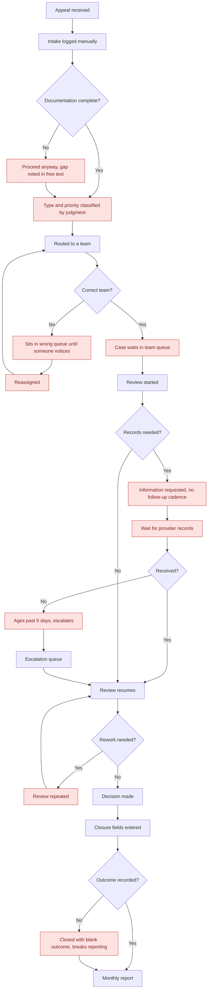

# As-Is Process Map — Appeals Friction Radar

Mermaid renders natively on GitHub. Pain points are marked in red.

## Pain points in words

| # | Pain point | Observed effect in the data |
|---|---|---|
| P1 | Intake accepts incomplete documentation | Rework rate 31.7% vs 7.7% when complete |
| P2 | Routing depends on individual judgment | First-pass accuracy 81.7% on claims payment |
| P3 | Wrong-queue cases are found late | Routing stage carries the second-highest dwell time |
| P4 | No follow-up cadence on records requests | Escalations concentrate past day 5 |
| P5 | Handoffs add time with no tracking | +4.9 days average per additional handoff |
| P6 | Closure fields not enforced | Closed cases with blank outcome, logged as DQ-02 |

## Where the time sits

Average closed-case days by stage: intake 0.9, routing 1.9, waiting for review 1.6,
review 9.1, closure 1.5. About 4.3 days per case is queueing and administration rather
than review work.
