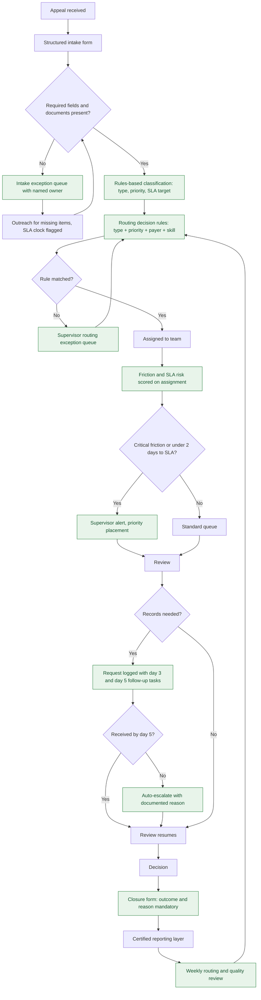

# To-Be Process Map — Appeals Friction Radar

## Controls introduced

| Control | Addresses | Owner |
|---|---|---|
| Blocking intake validation with exception queue | P1 | Intake Supervisor |
| Rules-based classification and SLA assignment | P1, P2 | Appeals Ops Manager |
| Documented routing rules with supervisor exception path | P2, P3 | Appeals Ops Manager |
| Friction and SLA scoring at assignment | P3, P4 | Reporting Analyst |
| Day 3 / day 5 follow-up tasks on records requests | P4 | Clinical Review Lead |
| Auto-escalation with reason capture | P4 | Clinical Review Lead |
| Mandatory closure fields | P6 | Quality Lead |
| Weekly review that feeds rules back into routing | P2, P5 | Operations Director |

The feedback loop from the weekly review back to the routing rules is the part that keeps
this from decaying. Rules set once and never revisited are how the current state happened.
